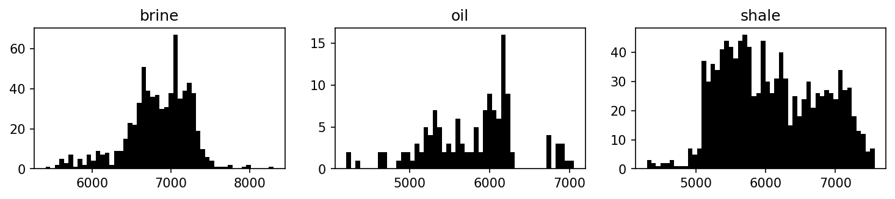
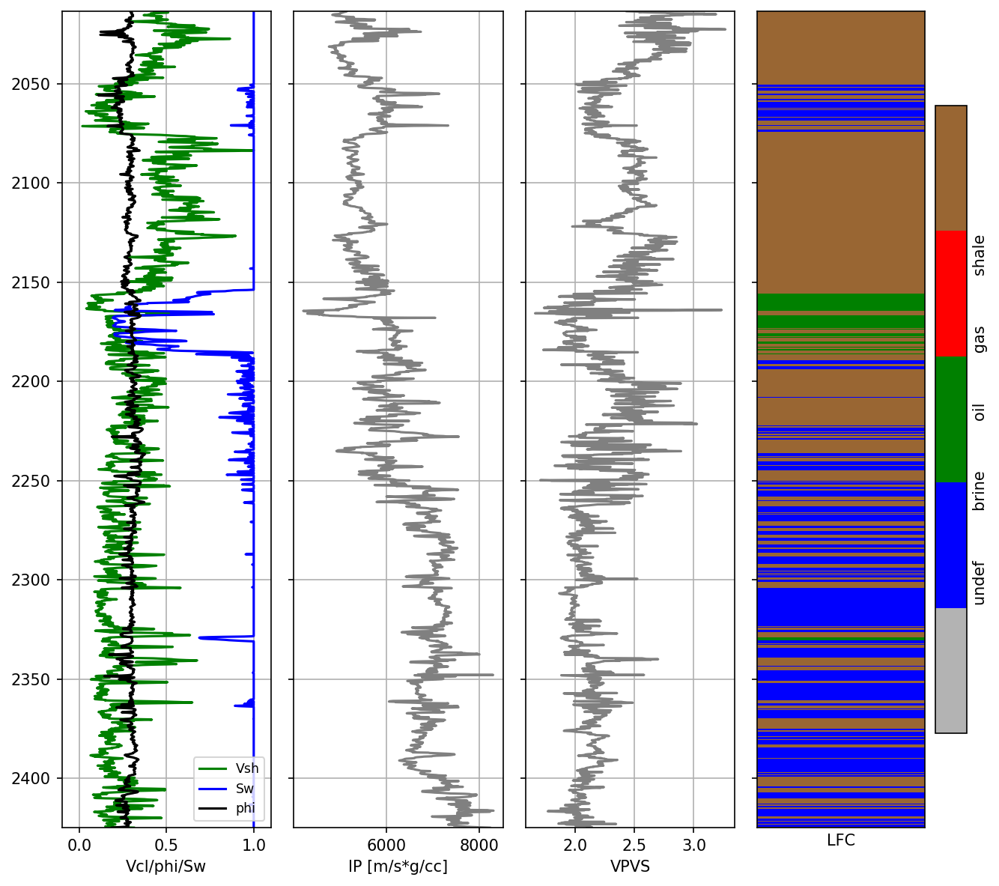
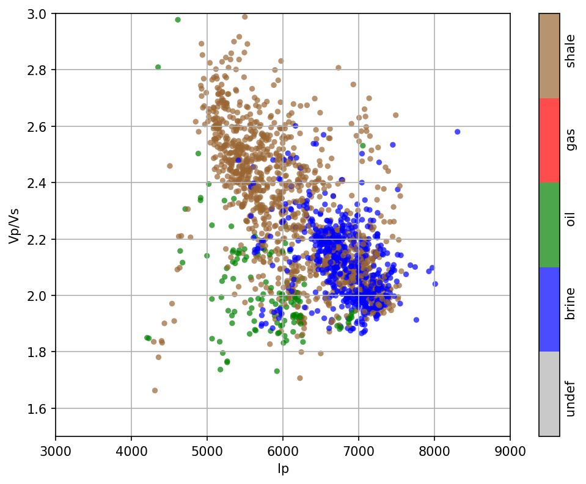
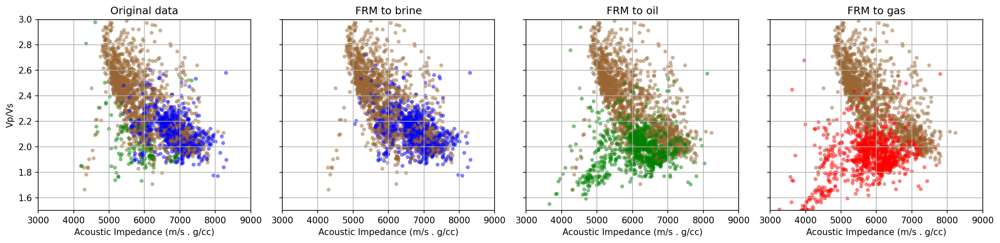
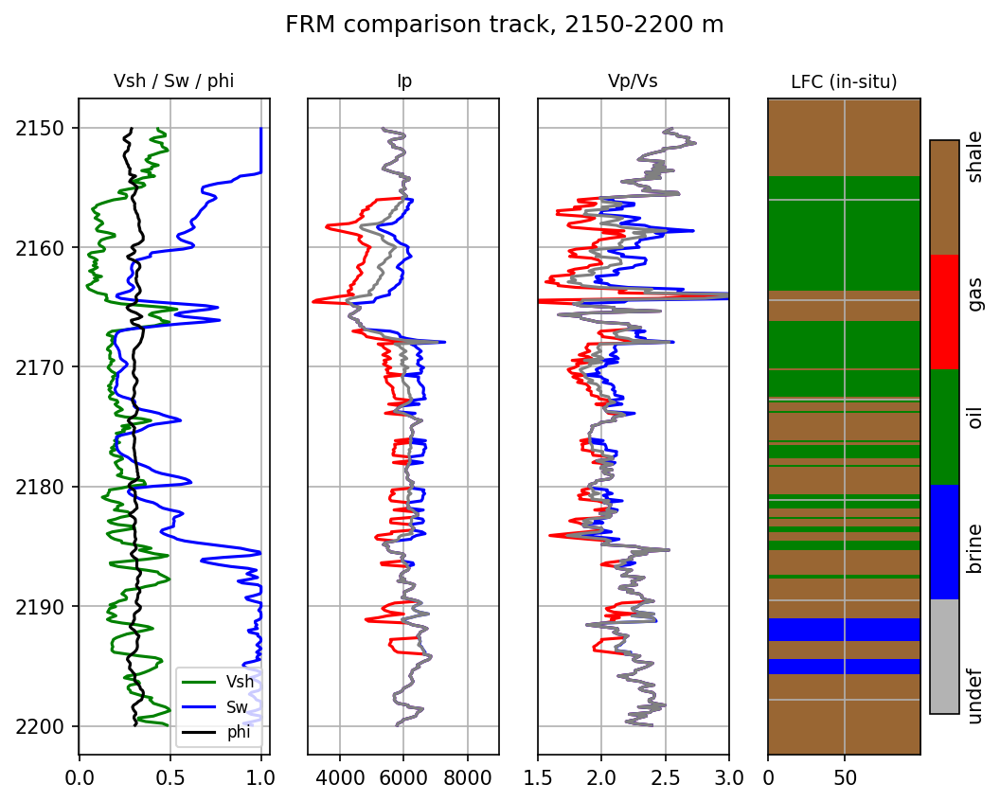

# Fluid Replacement Modeling (FRM)


Implementation of **Fluid Replacement Modeling (FRM)** using **Gassmann Fluid Substitution** for well-log analysis and rock physics modeling in Python.

---

# Overview

This project implements a complete Fluid Replacement Modeling (FRM) workflow based on **Gassmann's equation** to evaluate the effect of fluid substitution on the elastic properties of reservoir rocks while preserving the rock frame.

The notebook is designed as a reproducible workflow for quantitative rock physics analysis using well-log data.

---

# Features

- Well-log quality control
- Petrophysical data preparation
- Lithology and fluid classification
- Dry-rock property estimation
- Gassmann fluid substitution
- Updated elastic property calculation
- Rock physics visualization
- Automatic figure generation
- CSV result export

---

# Project Structure

```text
FRM/
├── README.md
├── data/
│   └── qsiwell2.csv
│
├── notebook/
│   └── 01_FRM_Gassmann_Fluid_Substitution.ipynb
│
└── outputs/
    ├── frm_week1_results.csv
    └── figures/
        ├── facies_histogram.png
        ├── frm_comparison_track.png
        ├── frm_crossplot.png
        ├── original_crossplot.png
        └── well_log_track.png
```

---

# Workflow

```text
Well Log Data
      │
      ▼
Quality Control
      │
      ▼
Petrophysical Data Preparation
      │
      ▼
Lithology & Fluid Classification
      │
      ▼
Dry Rock Property Estimation
      │
      ▼
Gassmann Fluid Substitution
      │
      ▼
Updated Elastic Properties
      │
      ▼
Rock Physics Analysis
      │
      ▼
Visualization
      │
      ▼
Export Results
```

---

# Input

The workflow requires a processed well-log dataset containing the following properties.

| File | Description |
|------|-------------|
| `qsiwell2.csv` | Input well-log dataset |

### Required Logs

| Log | Description |
|-----|-------------|
| DEPTH | Measured depth |
| VP | P-wave velocity |
| VS | S-wave velocity |
| RHO | Bulk density |
| PHIE | Effective porosity |
| SWE | Water saturation |
| VSH | Volume of shale |

---

# Output

The notebook automatically generates:

## Processed Dataset

```text
outputs/
└── frm_week1_results.csv
```

The exported dataset contains

- Updated elastic properties
- Rock physics parameters
- Lithology classification
- Fluid substitution results

## Figures

```text
outputs/
└── figures/
```

Generated figures include

- Well Log Track
- Original Crossplot
- FRM Crossplot
- FRM Comparison Track
- Facies Histogram

---

# Methodology

The implemented workflow consists of the following major steps:

1. Load and validate well-log data.
2. Restrict the analysis interval.
3. Perform lithology and fluid classification.
4. Estimate dry-rock elastic properties.
5. Apply Gassmann fluid substitution.
6. Calculate updated elastic properties.
7. Generate quality-control plots.
8. Export processed data and figures.

---

# Results

The notebook automatically generates several quality-control plots.

## Facies Histogram



---

# Well Log Track



---

## Original Crossplot



---

## FRM Crossplot



---

## FRM Comparison



---

# Software

- Python 3.x
- Jupyter Notebook

### Main Libraries

- NumPy
- Pandas
- Matplotlib
- SciPy
- Pathlib

---

# How to Run

1. Clone the repository.

```bash
git clone https://github.com/antoniushk/KP_RFD.git
```

2. Navigate to the project directory.

```text
Week_1/FRM/
```

3. Open the notebook.

```text
notebook/01_FRM_Gassmann_Fluid_Substitution.ipynb
```

4. Execute all notebook cells.

5. The processed dataset and figures will be automatically saved in

```text
outputs/
```

---

# References

- Avseth, P., Mukerji, T., & Mavko, G. (2005). *Quantitative Seismic Interpretation*. Cambridge University Press.
- Mavko, G., Mukerji, T., & Dvorkin, J. (2009). *The Rock Physics Handbook* (2nd Edition). Cambridge University Press.
- Gassmann, F. (1951). *Elastic Waves Through a Packing of Spheres*. Vierteljahrsschrift der Naturforschenden Gesellschaft in Zürich.

---

# Author

**Antonius Hardiantono K.**

Department of Geophysical Engineering

Institut Teknologi Sepuluh Nopember (ITS)